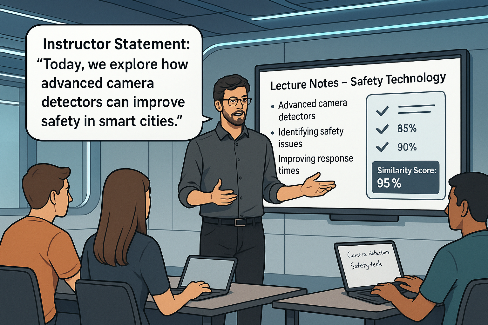
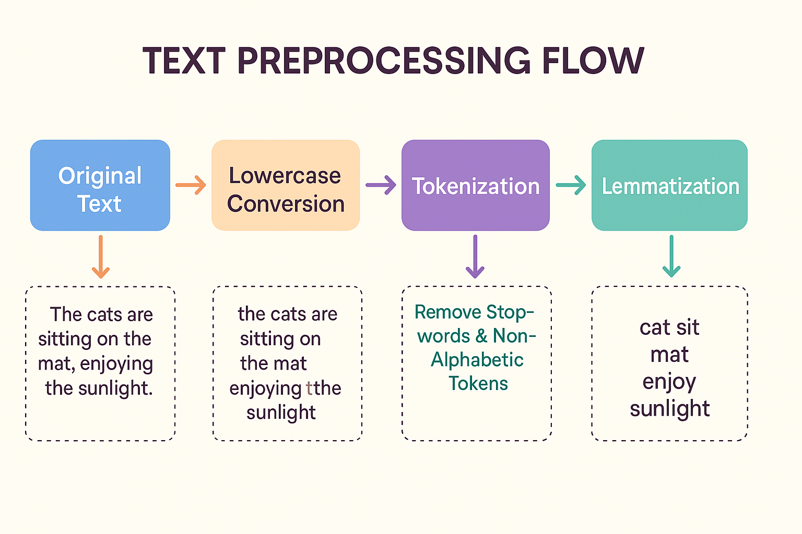

# 📚 Instructor Content Similarity Checker API

> 🔍 **Detects whether a spoken or written statement aligns with educational content like slides or lecture notes.**

This Flask-based API leverages **BERT sentence embeddings** and **cosine similarity** to evaluate how closely two pieces of text are related — ideal for verifying that an instructor is discussing relevant course material.

---

## 🎯 Use Case: Lecture Verification System

In many educational settings, instructors might veer off-topic or provide unverified commentary. This tool compares live-transcribed speech or uploaded notes with reference documents.

**✔️ Purpose:**
- Validate academic speech against official material
- Detect off-topic lectures or irrelevant content
- Automate content alignment checks in smart classrooms

<br/>



---

## 🔧 How It Works: Text Preprocessing Pipeline

Before computing similarity, both texts are preprocessed to clean and normalize them:



---

## 🧠 Core Logic: Semantic + Cosine Similarity

# Text Comparison Methods

## 1. Descriptions

| **Method**            | **Description**                                                                 |
|-----------------------|---------------------------------------------------------------------------------|
| **Lexical Similarity** | Compares exact words or word frequencies.                                        |
| **Syntactic Similarity** | Compares sentence structure and grammar (e.g., word order, dependencies).         |
| **Cosine Similarity**  | Measures the cosine of the angle between vector representations of the texts (using word embeddings, TF, or TF-IDF). |

---

## 2. Suitability for Comparing Instructor's Explanation

| **Method**            | **Suitability for Comparing Instructor's Explanation**                                                                                                                                                                                                                                                                                                                                                                 |
|-----------------------|------------------------------------------------------------------------------------------------------------------------------------------------------------------------------------------------------------------------------------------------------------------------------------------------------------------------------------------------------------------------------------------------------------------------|
| **Lexical Similarity** | **Less suitable**: Focuses on word overlap and misses meaning. If different words or synonyms are used to explain the same idea, lexical similarity will not capture the similarity accurately.                                                                                                                                                                 |
| **Syntactic Similarity** | **Less suitable**: The sentence structure might vary while conveying the same idea. This method doesn't capture the meaning effectively, especially when explanations differ in phrasing or word order.                                                                                                                                                           |
| **Cosine Similarity**  | **Most suitable**: Focuses on the underlying meaning of the texts. It handles synonyms, varied phrasing, and different sentence structures well, making it ideal for comparing ideas, especially in instructional contexts where the content matters more than exact wording or structure. |


## 🧮 What is Cosine Similarity?

Cosine similarity measures how similar two vectors are by computing the **cosine of the angle between them**:

\[
\text{similarity} = \cos(\theta) = \frac{A \cdot B}{\|A\| \|B\|}
\]

- **1.0** = identical direction (high similarity)  
- **0.0** = orthogonal (no similarity)  
- **-1.0** = opposite directions


### 🔹 Sentence Embedding
Each sentence is converted into a high-dimensional vector using:
> `SentenceTransformer('bert-base-nli-mean-tokens')`

### 🔹 Cosine Similarity Calculation
The API uses cosine similarity to quantify the semantic alignment between vectors.

```python
similarity = cosine_similarity([vectorA], [vectorB])[0][0]

---

### 🏃‍♂️ Run the App

```bash
python app.py
```

📍 API will run at:  
`http://127.0.0.1:5000/calculate_similarity`

---

## 🔗 API Endpoint

### `POST /calculate_similarity`

#### 📨 Request Body

```json
{
  "document1": "Instructor's spoken content...",
  "document2": "Lecture document or notes..."
}
```

#### 📤 Response

```json
{
  "similarityScore": 92.45
}
```

---

## 🧪 Example Test (cURL)

```bash
curl -X POST http://127.0.0.1:5000/calculate_similarity \
-H "Content-Type: application/json" \
-d '{"document1":"Smart cameras can help improve city safety.","document2":"This document explains how advanced camera detectors increase safety in smart cities."}'
```


---

## 🚀 Getting Started

### Prerequisites
- Docker
- Python 3.10 (if running without Docker)

### 🔨 Run via Docker

```bash
# Build the container
docker build -t similarity-api .

# Run the container
docker run -p 5000:5000 similarity-api
```

---

## 🗂 Project Structure

```
semantic-similarity-app/
├── app.py
├── Dockerfile
├── README.md
├── instructor_classroom.png
└── preprocessing_infographic.png
```

---

## 🤝 Built With

- 🐍 Python & Flask — for API handling
- 🧠 BERT (via `sentence-transformers`) — for semantic embedding
- 📊 scikit-learn — cosine similarity
- 📦 Docker — easy deployment

---

## 📌 Final Thoughts

This tool is ideal for:
- Smart classrooms & e-learning platforms
- LMS integration for lecture audits
- AI-based content relevance engines

> Let your lectures speak with **meaning** — and let this API verify it. ✅

```

---
